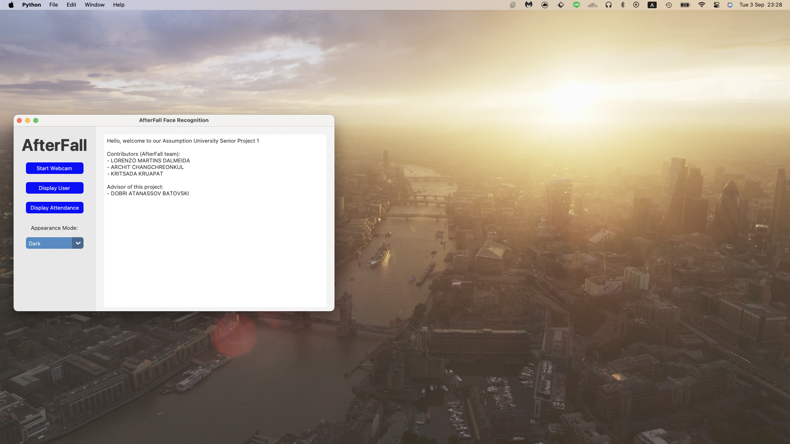
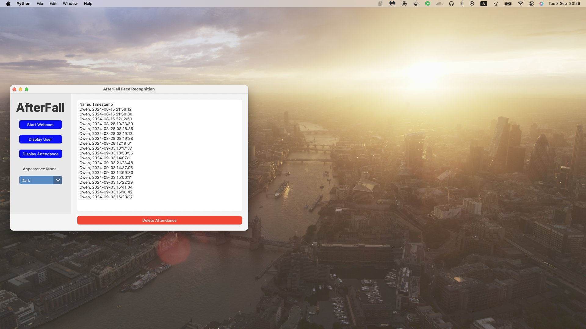
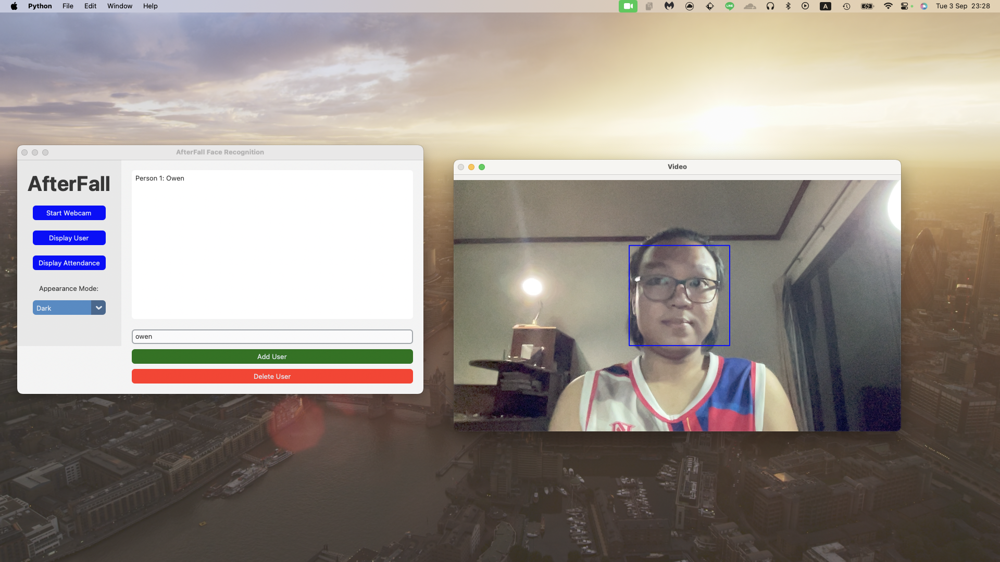
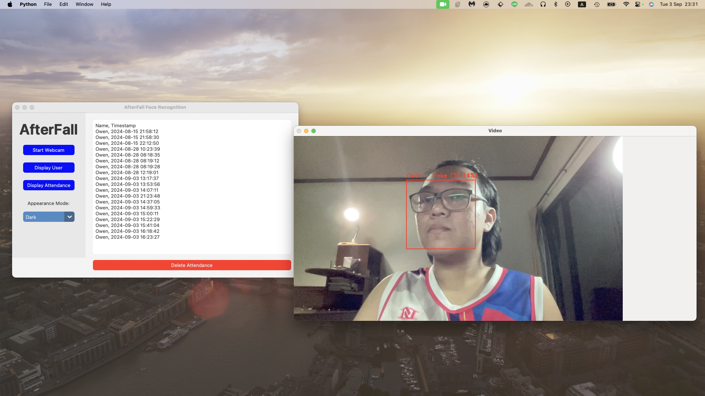
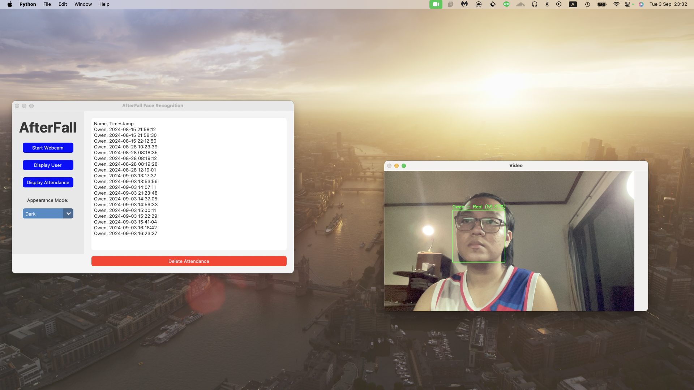
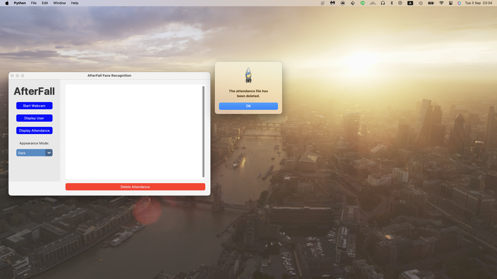

# webcam-antispoofing - AfterFall team SP1:

### Using python 3.9.5

install create python env bash command interminal:
```bash
brew install python@3.9  
python3.9 -m venv myenv
source myenv/bin/activate  # On macOS/Linux myenv\Scripts\activate  # On Windows
pip install -r requirements.txt
pip list # check all the library
```

if haing issue dlib library use this command 
```bash
brew install cmake
brew install boost
brew install boost-python3
brew install jpeg
```

Then reinstall dlib

```bash
pip uninstall dlib
pip install dlib
```

# Running the GUI python app

clone this repo
```bash
gh repo clone OwenYooYoo/webcam-antispoofing
cd webcam-antispoofing
pip install -r requirements.txt
```

```bash
python main.py

```
# All Fuction

### First page of this app:

### Display attendanceCheck.csv:

### Delete and Saving the face by using OpenCV and do augemention face image:
https://github.com/OwenYooYoo/Augmentation-FaceRecognition


### Liveness detection by detect the eye blinking:

### Face recognition:

### Detele All attendanceCheck.csv


# References:

https://github.com/ageitgey/face_recognition/blob/master/examples/facerec_from_webcam.py

https://github.com/ageitgey/face_recognition/blob/master/examples/blink_detection.py

https://www.datacamp.com/tutorial/face-detection-python-opencv

https://medium.com/@fareedkhandev/modern-gui-using-tkinter-12da0b983e22

